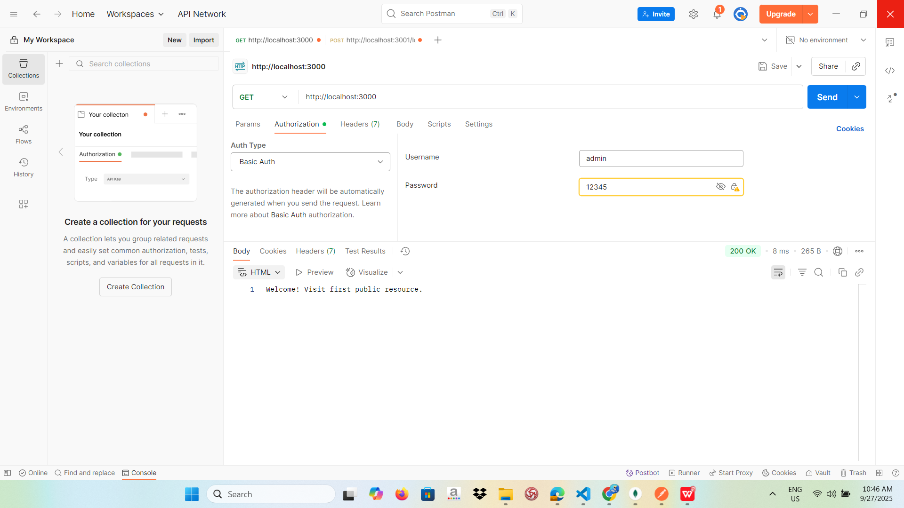
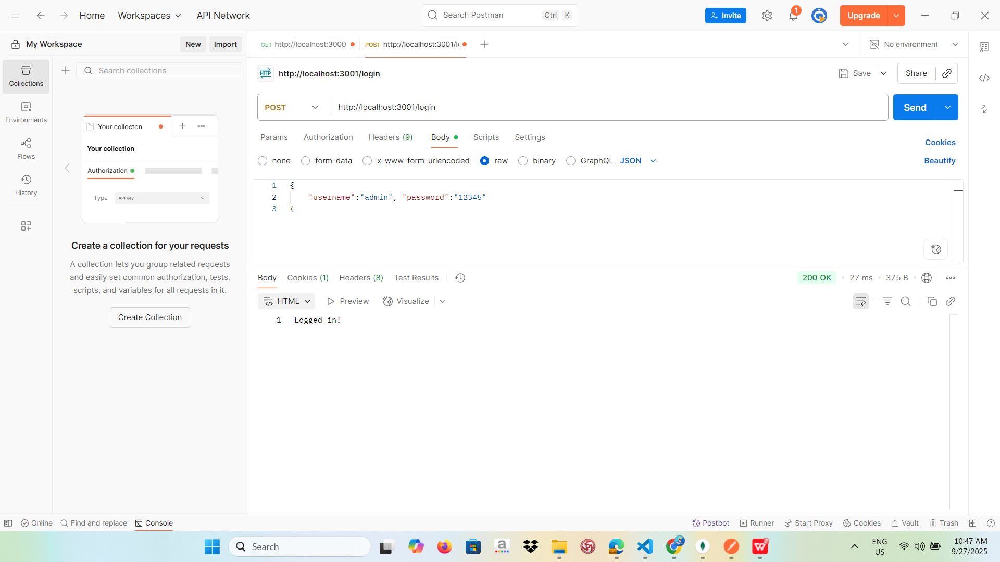
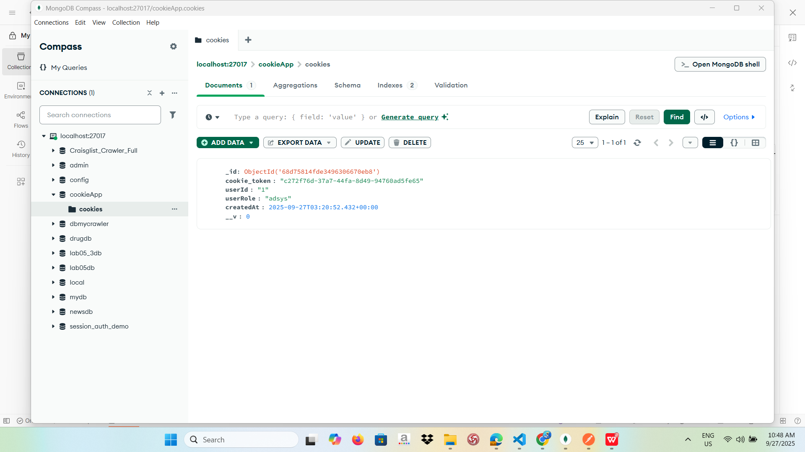

# Simple Authentication (Node.js)

## 📌 Mô tả
Bài lab này minh họa **Basic Authentication** và **Cookie Authentication** trong Node.js.

- `basic_auth.js`: Xác thực người dùng bằng **Authorization Header** (Basic Auth).
- `cookie_auth.js`: Xác thực bằng **Cookie** và lưu session.

---

## 🚀 Cách chạy
1. Cài đặt dependencies:
   ```bash
   npm install
2.Chạy server Basic Auth: node basic_auth.js
3.Chạy server Cookie Auth: node cookie_auth.js
Mặc định server chạy ở http://localhost:3000

Test với Postman
1. Basic Auth (basic_auth.js)

Method: GET

URL: http://localhost:3000/secure

Authorization: Chọn Basic Auth

Username: admin

Password: 12345
## Demo kết quả

2. Cookie Auth (cookie_auth.js)

Step 1: Gửi request POST http://localhost:3001/login với body:

{
  "username": "admin",
  "password": "12345"
}
## Demo kết quả


→ Server trả về Cookie.

Mongo compass: 
## Demo kết quả


📂 Cấu trúc thư mục
simple_auth/
│── basic_auth.js
│── cookie_auth.js
│── package.json
│── package-lock.json
│── node_modules/
└── README.md

✍️ Sinh viên: Lê Huỳnh Như - 22651101
